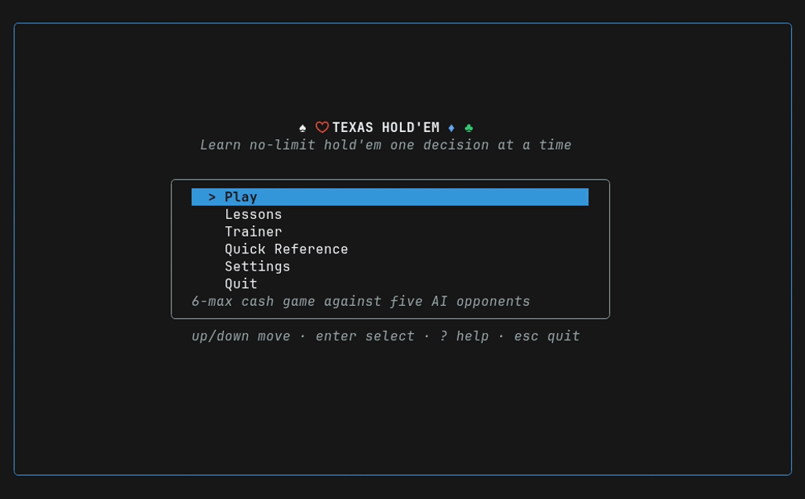

# Texas Hold'em


[](https://github.com/BrandonDedolph/texas-holdem/releases/latest)

A terminal Texas Hold'em game built to **teach you the game**, not just simulate
it — 6-max No-Limit cash game against AI opponents, with a live coach, guided
lessons, an equity trainer, and post-hand review. Built with
[Bubble Tea](https://github.com/charmbracelet/bubbletea).



> **v0.1.0 is out.** Play, lessons, trainer, coach, and post-hand review all
> work — install below, or `make run` from source.
>
> | Package | |
> |---|---|
> | `internal/engine` — betting, side pots, table lifecycle | ✅ |
> | `internal/eval` — 7-card evaluator (32 ns/op, 0 allocs) | ✅ |
> | `internal/equity` — ranges, exact enumeration, outs | ✅ |
> | `internal/ai` — opponents, five archetypes | ✅ |
> | `internal/coach` — advice, EV-loss grading, moments | ✅ |
> | `internal/tutorial` — 13-lesson curriculum | ✅ |
> | `internal/trainer` — four generated drill modes | ✅ |
> | `internal/review` — post-hand replay | ✅ |
> | `internal/app` — menus, table, lessons, trainer, review | ✅ |

## The idea

Most poker software either plays the game or drills the math. This does both, in
one loop: you play real hands, a coach explains each decision *before* you make
it, grades it *after*, and the post-hand review shows you what everyone actually
held.

The design is organised around one principle that most poker tools get wrong:

> **Grade the decision, not the outcome.**
> A call with correct pot odds that loses is a good call. A bluff that got a fold
> but had no fold equity was still a bad bluff.

So grades are computed from what you knew *before the next card is dealt* and
never revised. The review then deliberately juxtaposes decision quality against
result — right play / bad result, wrong play / lucky result — and the headline
session statistic is **decision accuracy, not chips won**. Watching those two
numbers diverge over a session *is* the variance lesson.

## Features

**Play**
- 6-max No-Limit Hold'em cash game — fixed blinds, rebuy anytime
- Five opponent archetypes (Nit, TAG, LAG, Calling Station, Maniac), each of
  which exists to teach a specific adjustment. You learn far more from *"seat 4
  is a calling station, so stop bluffing them"* than from six identical bots.
- Opponents provably cannot cheat — the AI receives a view of the table that
  physically excludes your cards
- Side pots, odd chips, and all-in run-outs handled properly, and displayed in
  the open rather than hidden

**Learn**
- **Live coach** — recommendation plus reasoning with real numbers ("you need
  25% to call and have ~31% — 9 outs, rule of 4 says 9×4 ≈ 36%"), then a graded
  verdict on what you did. Three verbosity levels, because eventually you want
  to be caught only when you're wrong.
- **13 guided lessons** — hand rankings → position → preflop ranges → pot odds →
  outs → playing draws → betting → sizing → reading players → bluffing. Lessons
  run in the real engine on scripted deals, so they aren't a parallel simulation.


- **Trainer** — hand-ranking speed quiz, outs counting, equity estimation, and
  "what's your action here?" spot quizzes, with difficulty that adapts to your
  weak spots. Questions are generated and verified against the evaluator, so the
  pool is infinite and always correct.


- **Post-hand review** — replay with every hole card revealed, your frozen grades
  on the timeline, and a ledger of which decisions actually leaked EV

**Terminal**
- Four-color deck by default (flush blindness is a real beginner leak)
- A "Learn" speed that pauses on every new street until you've read the board
- Works at 80×24, expands at ≥104 cols, degrades to a readable ledger at 60×20
- ASCII fallbacks for terminals without Unicode or color

## Build

Requires Go 1.25+.

```bash
git clone https://github.com/BrandonDedolph/texas-holdem.git
cd texas-holdem
make run        # or: go run ./cmd/holdem
```

```bash
make build      # Build to bin/holdem
make test       # Run tests
make lint       # Run linter
```

**One-line install (macOS / Linux, no Go needed)**
```bash
curl -fsSL https://raw.githubusercontent.com/BrandonDedolph/texas-holdem/main/install.sh | sh
```
Downloads the right prebuilt binary for your OS/arch and puts it on your PATH.
Set `HOLDEM_INSTALL_DIR` to choose where it lands.

**With Go installed**
```bash
go install github.com/BrandonDedolph/texas-holdem/cmd/holdem@latest
holdem
```

Or grab an archive from the [latest release](https://github.com/BrandonDedolph/texas-holdem/releases/latest).

> Runs in any modern terminal; use at least an 80×24 window (it falls back to a
> compact layout down to 60×20).

## Design documents

| Doc | Covers |
|---|---|
| [DESIGN.md](docs/DESIGN.md) | Cross-layer contracts, build order — **read first** |
| [BRIEF.md](docs/BRIEF.md) | Product decisions and scope |
| [design-engine.md](docs/design-engine.md) | Cards, hand evaluation, betting rules, side pots |
| [design-learning.md](docs/design-learning.md) | AI, equity, coach, lessons, trainer, review |
| [design-tui.md](docs/design-tui.md) | Screens, table layout, action bar, theming |

<details>
<summary>Planned project structure</summary>

```
cmd/holdem/          # Entry point
internal/
  engine/            # Cards, betting state machine, side pots, table lifecycle
  eval/              # 7-card hand evaluation
  equity/            # Ranges, enumeration, outs, pot odds
  ai/                # Player/Strategy, rule-based baseline, archetypes
  coach/             # Advice, grading, explanations, teachable moments
  tutorial/          # Guided lesson curriculum
  trainer/           # Standalone drills
  review/            # Post-hand replay
  profile/           # Progress and stats persistence
  app/               # Bubble Tea screens
  ui/                # Card/seat/pot rendering, theme
```
</details>

## Acknowledgments

Built with the [Charm](https://charm.sh) ecosystem:
[Bubble Tea](https://github.com/charmbracelet/bubbletea),
[Lip Gloss](https://github.com/charmbracelet/lipgloss).
Sibling project: [euchre](https://github.com/BrandonDedolph/euchre).

## License

MIT
